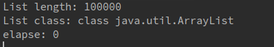

---                                                 
layout: post  
title: Scala ArrayBuffer/ListBuffer vs Java ArrayList                
date: 2019-03-11                                                  
author: AlstonWilliams                              
header-img: img/post-bg-2015.jpg   
catalog: true                                       
categories:                                         
- Scala                                    
tags:                                               
- Scala                                    
---

在我们编写Scala代码的时候，由于ListBuffer方便的特性，所以经常会使用ListBuffer。过去也一直没有什么问题。

但是呢，最近在我们的项目中，出现了一个非常严重的性能问题。通过JProfiler分析，发现是调用ListBuffer的获取数据的方法时，太慢导致的。

差距有多大呢？以前需要运行12个小时，改成了Java的List以后，直接缩短了四个小时。

这篇文章中，我不会具体分析ArrayBuffer/ScalaBuffer等的代码，只会给出测试的结果。

## Scala ArrayBuffer

~~~
package com.hyper

import scala.collection.JavaConverters._
import scala.collection.mutable.ArrayBuffer

object TestScalaList {

    def main(args: Array[String]): Unit = {

        val scalaListBuffer: ArrayBuffer[String] = ArrayBuffer[String]()
        val itemNumber = 100000

        for (i <- 0 until itemNumber) {
            scalaListBuffer += i.toString
        }

        IterateList.iterate(scalaListBuffer.toList.asJava)
    }

}
~~~

`IterateList`的代码如下:
~~~
package com.hyper;

import com.google.common.base.Stopwatch;

import java.util.List;
import java.util.concurrent.TimeUnit;

public class IterateList {

    public static void iterate(List<String> list) {
        int listLength = list.size();

        System.out.println("List length: " + listLength);

        Stopwatch stopwatch = new Stopwatch();
        stopwatch.start();

        System.out.println("List class: " + list.getClass());
        for (int i = 0; i < listLength; i++) {
            list.get(i);
        }

        long elapse = stopwatch.elapsed(TimeUnit.SECONDS);
        System.out.println("elapse: " + elapse);
    }

}
~~~

运行上面的代码，我们可以看到如下结果:

运行了15s。时间不短。它的底层还是数组实现的呢。

## Java ArrayList

那我们再来看下Java ArrayList的性能。

~~~
package com.hyper;

import java.util.ArrayList;
import java.util.List;

public class TestJavaList {

    public static void main(String[] args) {
        List<String> list = new ArrayList<>();

        int itemNumber = 100000;

        for (int i = 0; i < itemNumber; i++) {
            list.add(String.valueOf(i));
        }

        IterateList.iterate(list);
    }

}
~~~

结果如下:

仅仅用了0s，1s都不到。

都是用数组实现的，差距咋这么大呢？

我没有仔细探究，猜测一个是因为SeqWrapper这东西，增加了调用栈的深度，进一步增加了运行时间，但是这个应该不会导致这么大的差距。所以更可能的原因是，Scala实现的这个ArrayBuffer就有问题。

有时间仔细研究一下源码和字节码，补充上来。

## Scala ListBuffer

这个是我们Scala中最常用的数据结构，Spark代码中也有意无意的总用到这个数据结构。

我们都知道，Java中ArrayList和LinkedList这两种数据结构，各有各的优缺点，各有各的应用场景。在Scala中，ArrayBuffer就是ArrayList的另一个版本，而ListBuffer就是LinkedList的另一个版本。所以，拿ListBuffer那两个数据结构对比，有点不公平。毕竟ListBuffer不适合随机读取。

但是既然做了，这里还是贴上来。

~~~
package com.hyper

import scala.collection.JavaConverters._
import scala.collection.mutable.ListBuffer

object TestScalaList {

    def main(args: Array[String]): Unit = {

        val scalaListBuffer: ListBuffer[String] = ListBuffer[String]()
        val itemNumber = 100000

        for (i <- 0 until itemNumber) {
            scalaListBuffer += i.toString
        }

        IterateList.iterate(scalaListBuffer.toList.asJava)
    }

}
~~~

结果如下:

Oh My God，竟然运行了45s。

## 总结

从测试结果中，我们可以看到，Scala代码，性能跟Java代码还是有一定差距的。

所以能用Java还是尽量用Java为好。
