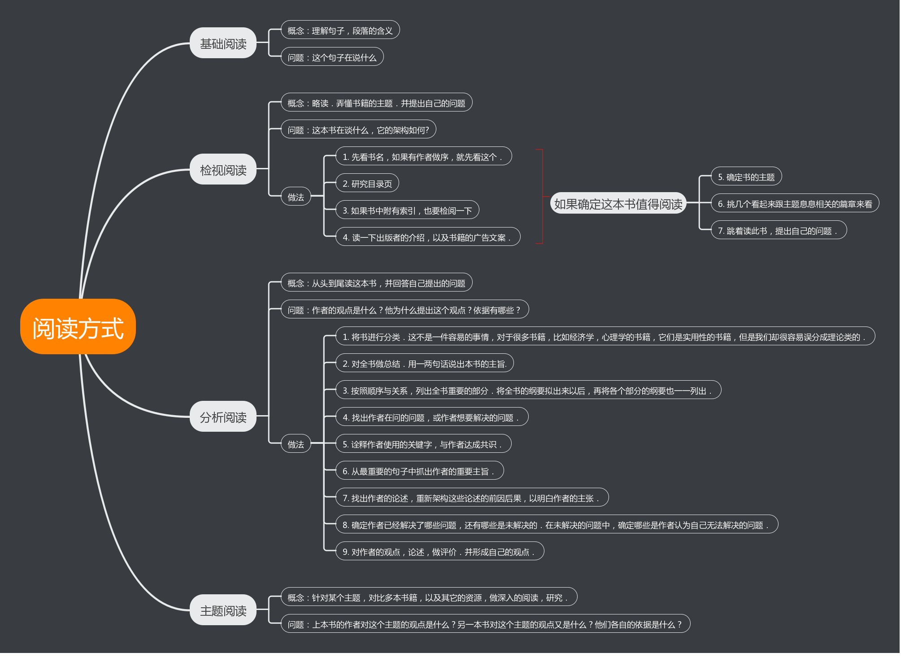

# 《如何阅读一本书》书评

今日在家无聊，翻了一遍《如何阅读一本书》．

这本书早就购来了，但是一直没有动过．最近从某个博客上看到了此书中的只言片语，感觉实在是醍醐灌顶，于是下决心翻一下这本书．

我这人，很喜欢阅读各种咨询．最喜欢阅读书籍，各种书籍，从实用性书籍，到技术书籍，还有艺术，哲学等方面，都有涉猎．也喜欢阅读新闻，各种博客，文章，既能减压，又想从中获取一些咨询．

但是，读的书越多，却越发发现，能够记住的实在是寥寥无几．很多书，我能用一两句话概括这些书籍，也确实从这些书中，收获了对世界的认知，对自我的补全．但是，书中的细节，我却很少能记住．

就拿前两周翻过的《极简欧洲史》来说，尽管我翻这本书的初衷，是从中找出中国和西方世界政治制度差异的原因，即西方为什么会诞生民主，翻完以后，我也大概理解了中西方政治制度差异的起源，以及中西方政体的优劣．但是，对书中，欧洲各国的演化，这里却并没有记住．

而将来若我想告诉我的孩子，西方的起源，这部分知识又是必不可少的．

书中的内容记不住，一部分原因是书确实差，毕竟好书就那么多．更重要的原因，是读的时候，就没有深入．没有做笔记．即使做了笔记，日后也没有进行review．

第一部分原因的影响，应该很有限．因为，如果这本书写的实在太烂，把我带不进去，读一小部分，我就读不下去了．而且，我读的书，一般都是Google之后，挑出来的评价普遍比较好的书籍．

而今日翻了《如何阅读一本书》以后，我发现，我在阅读的过程中，存在着几个非常不好的习惯，导致我阅读的效果大打折扣:
- 没有先根据书名，目录，序言来对书籍的整体结构，内容，做一个简单了解．也就导致并不是带着问题读书．
- 做笔记的数量很少．其实读《吴晓波企业史》的时候，做的笔记还是蛮多的．但是都是局限于一点，很多时候也是对一两句话的自己的理解．对于结构性的笔记，基本上没有．这就导致不能把握书籍的整体脉络．

这里也吐槽一下流行的读书软件．过去一段时间，我发现了微信读书这款软件．它上面的书籍确实蛮多的，而我当时也已经受不了下载劣质的pdf书籍来阅读，家里空间又实在有限，不能够买很多书籍．就一直用这个软件读书．现在看起来，这款软件设计的缺陷，就是我们无法像读纸质书那样，随时做笔记，无法做直观的结构性笔记．

而有一些其它的软件，阅读pdf的软件，像WPS，Notability等，支持随时做笔记．但是，我们手写笔记的时候，往往字会过大，做笔记也不方便．另外，书籍找起来也有点麻烦，pdf版本很多也是劣质的．

尽管后者有这众多缺点，我想以后我还是要用这种方式来阅读各种书籍．仅仅使用第一种方式来阅读一些小说类的，不需要做笔记仔细深入的书籍．

现在我们一本正经地评价这本书．

这本书中，介绍了读书的四个层次，以及每个层次分别需要什么样的读书方式，要求．如下图所示:

`主题阅读`这部分我没有写，因为这一般是搞学术才需要的．对我而言不需要做到主题阅读．

大致分为这么几个阶段:
- 审视这本书是否值得阅读
- 如果值得阅读，那就先略读这本书，搞懂它的架构，并提出自己的问题
- 仔细阅读这本书，回答自己的问题，并对重要的部分做提纲
- 同作者进行交流，仔细审视作者的观点，以及论据，提出自己的观点

其实这个流程，不仅在阅读书籍的时候有用，在我们阅读报刊，观点，甚至于与人交谈，写作的时候，这都是一个非常有用的得到有价值信息的方式．

这本书，后半部分还介绍了针对各种书籍，特有的阅读方法．大体流程跟上面差不多，只是对某些题材的书籍，有一些定制化的阅读方式．

以后就要用从这本书中学到的方法，来阅读每一本书了．知行合一，是最重要的．